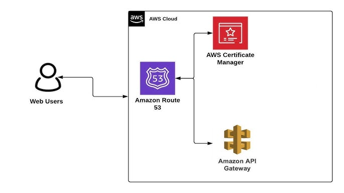

# **Módulo Terraform: cloudops-ref-repo-aws-acm-terraform**

## Descripción:

Este módulo facilita la creación y gestión de certificados SSL/TLS en AWS Certificate Manager (ACM) con todas las mejores prácticas de seguridad, nomenclatura y configuración según los estándares. Permite crear múltiples certificados con validación por DNS o EMAIL, configuración de algoritmos de clave, y opciones para esperar la validación del certificado.

Consulta CHANGELOG.md para la lista de cambios de cada versión. *Recomendamos encarecidamente que en tu código fijes la versión exacta que estás utilizando para que tu infraestructura permanezca estable y actualices las versiones de manera sistemática para evitar sorpresas.*

## Diseño AWS ACM



## Características

- ✅ Creación y gestión de múltiples certificados ACM usando mapas de objetos
- ✅ Soporte para validación por DNS y EMAIL
- ✅ Configuración flexible de dominios principales y dominios alternativos
- ✅ Selección de algoritmos de clave (RSA o ECDSA)
- ✅ Opciones para esperar la validación del certificado (opcional)
- ✅ Etiquetado consistente según estándares organizacionales
- ✅ Validaciones de entrada para prevenir configuraciones incorrectas
- ✅ Outputs detallados para facilitar la validación manual

## Estructura del Módulo
El módulo cuenta con la siguiente estructura:

```bash
cloudops-ref-repo-aws-acm-terraform/
└── sample/
    ├── data.tf
    ├── main.tf
    ├── outputs.tf
    ├── providers.tf
    ├── README.md
    ├── terraform.auto.tfvars.sample
    └── variables.tf
├── .gitignore
├── CHANGELOG.md
├── main.tf
├── outputs.tf
├── providers.tf
├── README.md
├── variables.tf
```

- Los archivos principales del módulo (`main.tf`, `outputs.tf`, `variables.tf`, `providers.tf`) se encuentran en el directorio raíz.
- `CHANGELOG.md` y `README.md` también están en el directorio raíz para fácil acceso.
- La carpeta `sample/` contiene un ejemplo de implementación del módulo.

## Implementación y Configuración

### Requisitos Técnicos

| Name | Version |
|------|---------|
| <a name="requirement_terraform"></a> [terraform](#requirement\_terraform) | >= 1.0.0 |
| <a name="requirement_aws"></a> [aws](#requirement\_aws) | >= 4.31.0 |

| Name | Version |
|------|---------|
| <a name="provider_aws.project"></a> [aws.project](#provider\_aws) | >= 4.31.0 |

### Provider Configuration

Este módulo requiere la configuración de un provider específico para el proyecto. Debe configurarse de la siguiente manera:

```hcl
# sample/providers.tf
provider "aws" {
  alias   = "principal"
  region  = var.aws_region
  profile = var.profile
  
  default_tags {
    tags = var.common_tags
  }
}

# sample/main.tf
module "acm" {
  source = "../"
  providers = {
    aws.project = aws.principal
  }
  # ... resto de la configuración
}
```

### Configuración del Backend

> **Recomendación importante**: Para entornos de producción y colaboración en equipo, se recomienda configurar un backend remoto para almacenar el estado de Terraform (tfstate). Esto proporciona:
>
> - Bloqueo de estado para prevenir operaciones concurrentes
> - Respaldo y versionado del estado
> - Almacenamiento seguro de información sensible
> - Colaboración en equipo
>
> Ejemplo de configuración con S3 y DynamoDB:
>
> ```hcl
> terraform {
>   backend "s3" {
>     bucket         = "pragma-terraform-states"
>     key            = "acm/terraform.tfstate"
>     region         = "us-east-1"
>     encrypt        = true
>     dynamodb_table = "terraform-locks"
>   }
> }
> ```
>
> Asegúrese de que el bucket S3 tenga el versionado habilitado y que la tabla DynamoDB tenga una clave primaria llamada `LockID`.

### Convenciones de nomenclatura

El módulo sigue un estándar de nomenclatura para los certificados:

```
{client}-{project}-{environment}-acm-{certificate_name}
```

Por ejemplo:
- `pragma-api-dev-acm-web`
- `pragma-api-dev-acm-api`

### Estrategia de Etiquetado

El módulo maneja el etiquetado de la siguiente manera:

1. **Etiquetas obligatorias**: Se aplican a través del provider AWS usando `default_tags` en la configuración del provider.
   ```hcl
   provider "aws" {
     default_tags {
       tags = {
         environment = "dev"
         project = "api"
         owner = "cloudops"
         area = "infrastructure"
         provisioned = "terraform"
         datatype = "operational"
       }
     }
   }
   ```

2. **Etiqueta Name**: Se genera automáticamente siguiendo el estándar de nomenclatura para cada certificado.

3. **Etiquetas adicionales por recurso**: Se pueden especificar etiquetas adicionales para cada certificado individualmente mediante el atributo `additional_tags` en la configuración de cada certificado.

### Recursos Gestionados

| Name | Type |
|------|------|
| [aws_acm_certificate.certificate](https://registry.terraform.io/providers/hashicorp/aws/latest/docs/resources/acm_certificate) | recurso |
| [aws_acm_certificate_validation.validation](https://registry.terraform.io/providers/hashicorp/aws/latest/docs/resources/acm_certificate_validation) | recurso |

### Parámetros de Entrada

| Name | Description | Type | Default | Required |
|------|-------------|------|---------|:--------:|
| <a name="client"></a> [client](#input\client) | Identificador del cliente | `string` | n/a | yes |
| <a name="project"></a> [project](#input\project) | Nombre del proyecto asociado a los certificados | `string` | n/a | yes |
| <a name="environment"></a> [environment](#input\environment) | Entorno de despliegue (dev, qa, pdn) | `string` | n/a | yes |
| <a name="certificates_config"></a> [certificates_config](#input\certificates_config) | Configuración de certificados en AWS Certificate Manager | `map(object)` | n/a | yes |

### Estructura de Configuración

```hcl
variable "certificates_config" {
  type = map(object({
    domain_name               = string
    subject_alternative_names = optional(list(string), [])
    validation_method         = string
    key_algorithm             = optional(string, "RSA_2048")
    wait_for_validation       = optional(bool, false)
    validation_record_fqdns   = optional(list(string), null)
    additional_tags           = optional(map(string), {})
  }))
}
```

| Name | Description | Type | Default | Required |
|------|-------------|------|---------|:--------:|
| <a name="domain_name"></a> [domain_name](#input\domain_name) | Nombre de dominio principal para el certificado | `string` | n/a | yes |
| <a name="subject_alternative_names"></a> [subject_alternative_names](#input\subject_alternative_names) | Lista de nombres de dominio alternativos | `list(string)` | `[]` | no |
| <a name="validation_method"></a> [validation_method](#input\validation_method) | Método de validación del certificado ("DNS" o "EMAIL") | `string` | n/a | yes |
| <a name="key_algorithm"></a> [key_algorithm](#input\key_algorithm) | Algoritmo de clave para el certificado | `string` | `"RSA_2048"` | no |
| <a name="wait_for_validation"></a> [wait_for_validation](#input\wait_for_validation) | Indica si Terraform debe esperar a que se complete la validación | `bool` | `false` | no |
| <a name="validation_record_fqdns"></a> [validation_record_fqdns](#input\validation_record_fqdns) | Lista de FQDNs para validación DNS específica | `list(string)` | `null` | no |
| <a name="additional_tags"></a> [additional_tags](#input\additional_tags) | Etiquetas adicionales para el certificado | `map(string)` | `{}` | no |

### Valores de Salida

| Name | Description |
|------|-------------|
| <a name="certificate_arns"></a> [certificate_arns](#output\certificate_arns) | ARNs de los certificados creados |
| <a name="certificate_domains"></a> [certificate_domains](#output\certificate_domains) | Dominios principales de los certificados creados |
| <a name="certificate_validation_options"></a> [certificate_validation_options](#output\certificate_validation_options) | Opciones de validación para los certificados creados |
| <a name="certificate_status"></a> [certificate_status](#output\certificate_status) | Estado de los certificados creados |
| <a name="dns_validation_records"></a> [dns_validation_records](#output\dns_validation_records) | Registros DNS necesarios para la validación (solo para certificados con validación DNS) |

### Ejemplos de Uso

```hcl
module "acm" {
  source = "git::https://github.com/somospragma/cloudops-ref-repo-aws-acm-terraform.git?ref=v1.0.0"
  
  providers = {
    aws.project = aws.principal
  }

  # Configuración común
  client      = "cliente1"
  project     = "proyecto1"
  environment = "dev"

  # Configuración de certificados
  certificates_config = {
    "api" = {
      domain_name               = "api.example.com"
      subject_alternative_names = ["api-dev.example.com"]
      validation_method         = "DNS"
      key_algorithm             = "RSA_2048"
      additional_tags = {
        application = "api-gateway"
      }
    },
    "web" = {
      domain_name               = "www.example.com"
      subject_alternative_names = ["example.com"]
      validation_method         = "DNS"
      key_algorithm             = "EC_prime256v1"  # ECDSA para mejor rendimiento
      additional_tags = {
        application = "frontend"
      }
    }
  }
}
```

## Escenarios de Uso Comunes

### Validación de certificados

Por defecto, este módulo crea certificados sin esperar a que se completen los procesos de validación. Esto es intencional ya que:

1. La validación de certificados suele requerir pasos manuales o estar a cargo de otros equipos
2. Los registros DNS pueden estar en diferentes cuentas o proveedores
3. La validación por correo electrónico siempre requiere intervención manual

#### Flujo de trabajo recomendado

1. **Crear el certificado** usando este módulo (sin esperar validación)
2. **Obtener la información de validación** de los outputs del módulo (`certificate_validation_options` o `dns_validation_records`)
3. **Realizar la validación** mediante uno de estos métodos:
   - Crear registros DNS manualmente en su proveedor DNS
   - Usar otro módulo de Terraform para crear los registros DNS
   - Hacer clic en los enlaces de validación recibidos por correo (para validación EMAIL)
4. **Esperar** a que AWS valide el certificado (puede tardar desde minutos hasta horas)

#### Validación automática (avanzado)

Para casos donde se desea que Terraform espere automáticamente a que se complete la validación:

1. Configure `wait_for_validation = true` en el certificado
2. Para validación DNS, asegúrese de que los registros DNS se creen antes de que Terraform intente validar el certificado

## Consideraciones Operativas

### Rendimiento y Escalabilidad

- **Algoritmos de clave**: Los algoritmos ECDSA (EC_prime256v1, EC_secp384r1) ofrecen mejor rendimiento que RSA para APIs de alto tráfico o aplicaciones web.
- **Límites de servicio**: ACM tiene un límite predeterminado de 2000 certificados por cuenta de AWS. Para necesidades de mayor escala, considere solicitar un aumento de límite o distribuir certificados entre múltiples cuentas.
- **Dominios comodín**: Para aplicaciones con muchos subdominios, considere usar certificados comodín (*.example.com) para reducir la necesidad de emitir y gestionar múltiples certificados.

### Limitaciones y Restricciones

- Los certificados de ACM solo pueden ser utilizados con servicios de AWS compatibles (CloudFront, API Gateway, ALB, etc.)
- Los certificados no pueden ser exportados para su uso fuera de AWS
- La validación por EMAIL requiere que el dominio tenga configurados registros MX válidos
- Los certificados en uso por otros servicios de AWS no pueden ser eliminados hasta que se eliminen esos servicios o se desvinculen de los certificados

### Costos y Optimización

- Los certificados de ACM son gratuitos si se utilizan con servicios de AWS compatibles
- No hay límite en el número de renovaciones automáticas
- No hay costos adicionales por usar validación DNS o EMAIL
- No hay costos por el número de dominios alternativos (SANs) en un certificado

## Seguridad y Cumplimiento

### Consideraciones de seguridad

- **Algoritmos de clave**: RSA_2048 es el mínimo recomendado para entornos de producción. Para mayor seguridad, considere usar RSA_4096 o algoritmos ECDSA (EC_prime256v1, EC_secp384r1).
- **Validación de dominios**: La validación DNS es más segura y automatizable que la validación por EMAIL.
- **Renovación de certificados**: Los certificados de ACM se renuevan automáticamente si están en uso. El parámetro `create_before_destroy = true` garantiza una renovación sin interrupciones.
- **Acceso y permisos**: Limite los permisos IAM para gestionar certificados ACM solo a los roles que lo requieran.

### Análisis de Seguridad

Este módulo ha sido analizado con [Checkov](https://www.checkov.io/) para detectar posibles vulnerabilidades y problemas de seguridad en la infraestructura como código.

#### Resultados del último escaneo

[](./security-reports/checkov/results.txt)

Puedes ver el reporte completo de seguridad en el [informe detallado](./security-reports/SECURITY-REPORT.md).

#### Resumen de hallazgos

| Severidad | Checkov | 
|-----------|---------|
| CRÍTICO   | 0       |
| ALTO      | 0       |
| MEDIO     | 0       |
| BAJO      | 0       |
| INFO      | 0       |
| **TOTAL** | 0       |

El análisis de seguridad no encontró problemas, lo que indica que el módulo sigue las mejores prácticas de seguridad para AWS Certificate Manager.

### Mejores Prácticas Implementadas

- Uso de algoritmos de clave seguros (mínimo RSA_2048)
- Renovación automática de certificados configurada con `create_before_destroy = true`
- Validaciones para garantizar configuraciones correctas
- Documentación detallada sobre cómo validar certificados
- Etiquetado consistente según estándares organizacionales
- Convenciones de nomenclatura estandarizadas

### Lista de Verificación de Cumplimiento

- [x] Nomenclatura de recursos conforme al estándar
- [x] Etiquetas obligatorias aplicadas a todos los recursos
- [x] Validaciones para garantizar configuraciones correctas
- [x] Documentación sobre cómo validar certificados
- [x] Soporte para algoritmos de clave seguros
- [x] Renovación automática de certificados configurada

## Observaciones

- Este módulo está diseñado para ser flexible y adaptarse a diferentes escenarios de validación de certificados.
- La validación DNS es generalmente preferible a la validación por EMAIL por ser más automatizable y segura.
- Para entornos de producción, se recomienda usar algoritmos ECDSA por su mejor rendimiento y seguridad equivalente con claves más pequeñas.
- Los certificados de ACM se renuevan automáticamente 60 días antes de su expiración si están en uso con servicios de AWS compatibles.
- Para certificados con validación DNS, asegúrese de que los registros DNS permanezcan configurados para permitir la renovación automática.
